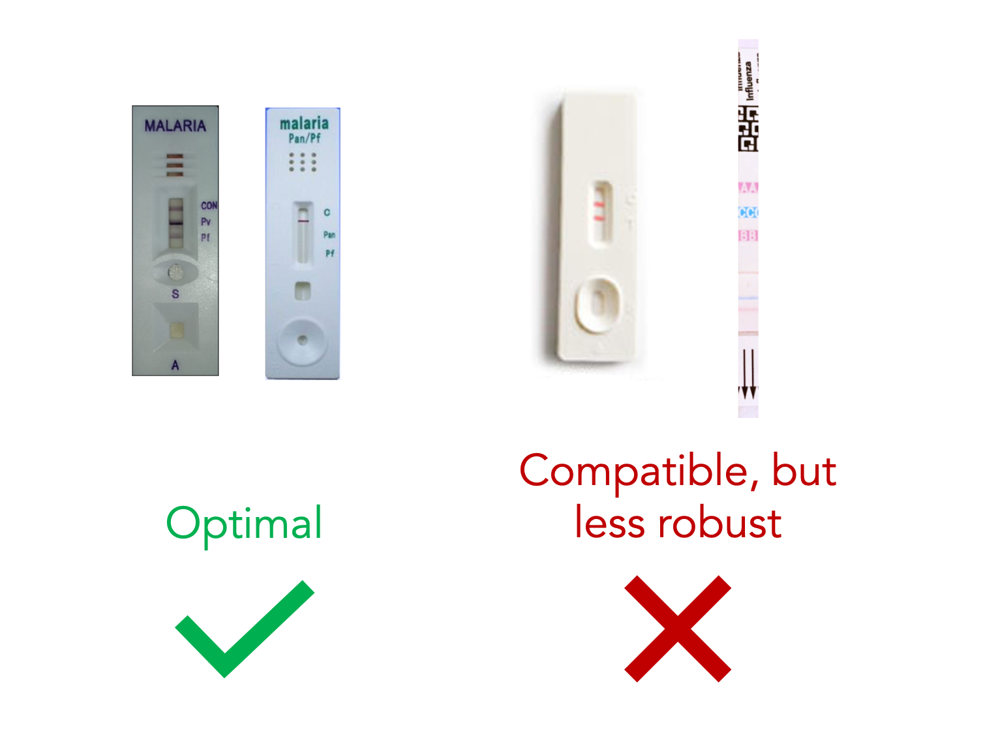

# Table of Contents
* [Overview](#overview)
* [Installation](#installation)
* [Configuration for New RDTs](#configuration-for-new-rdts)
* [API](#api)
* [Attribution](#attribution)
* [About Us](#about-us)
* [License](#license)

# Overview
RDTScan is an open-source library for developers who are interested in creating Android apps that support the digital curation and interpretation of [rapid diagnostic tests (RDTs)](https://en.wikipedia.org/wiki/Rapid_diagnostic_test). RDTScan provides the following functionality:

**1. Real-Time Quality Checking During Image Capture**  
RDTScan uses image processing to check the quality of images intercepted from the smartphone's camera while the user moves their smartphone over the RDT. RDTScan provides functions for checking the blurriness and lighting of incoming camera frames. If the image is in the camera's field-of-view, RDTScan also checks the scale and orientation of the RDT in the image. To help end-users capture the clearest image possible, RDTScan intelligently generates instructions based on these quality checks.

**2. Robust Result Interpretation**  
Assuming a suitable image has been captured, RDTScan can post-process the image to emphasize any faint lines that may appear on the immunoassay. The end-user can view the post-processed image for themselves to make a more informed decision about the RDT results. Alternatively, RDTScan provides a lightweight algorithm that interprets the test results on the end-user's behalf.

RDTScan uses a feature-matching approach for RDT recognition, allowing RDTScan to be quickly adapted to new RDT designs. Unlike model-driven approaches that require a dataset of example images for model training, RDTScan only requires a single example image and some additional metadata (e.g., relative position and meaning of each line) to detect and interpret RDTs. RDTScan is intentially designed so that all of the algorithms can run on the smartphone, which means that there is no need to upload confidential photos to a server to use this library.

**Disclaimers:** 
* Although RDTScan has been tested through multiple in-lab studies and real-world deployments, this library has not been FDA-approved.
* This library requires that target smartphone's support Android's [Camera2 API](https://developer.android.com/reference/android/hardware/camera2/package-summary), which supports control over the camera's hardware.

# Installation
RDTScan utilizes [OpenCV for Android](https://opencv.org/android/) for many of the image processing steps, which in turn relies on Android's [Native Development Kit (NDK)](https://developer.android.com/ndk/). Therefore, it is beyond the scope of the current project to export RDTScan's functionality as a `.jar` file. Instead, there are two options for getting started with RDTScan:
* **No existing project:** If you are making a smartphone app from scratch, you can simply clone the repository directly and build your app on top of what has already been provided. This repository has all of the dependencies properly configured along with a fully-functioning app that developers can use to get started.
* **Existing project:** If you have a smartphone app that has already been made and you are looking to add RDTScan to it, you will still need to add OpenCV for Android to your project. The [official tutorial](https://docs.opencv.org/2.4/doc/tutorials/introduction/android_binary_package/O4A_SDK.html) for doing this is fairly outdated, but there are plenty of other tutorials out there depending on your environment. Once you have done that, copy the following folders and files to your project (at the same path):
  * [`src/.../core/*`](app/src/main/java/edu/washington/cs/ubicomplab/rdt_reader/core)
  * [`src/.../util/*`](app/src/main/java/edu/washington/cs/ubicomplab/rdt_reader/utils)
  * [`assets/config.json`](app/src/main/assets/config.json)

### Troubleshooting:
* **Unable to locate NDK installation** If you have not already installed NDK, follow the instructions at this [link](https://developer.android.com/studio/projects/install-ndk) to do so. Once that is done, NDK should be installed at a path that either looks like `C:/Users/username/AppData/Local/Android/ndk/xx.x.xxxxxxx` (Windows) or `/Users/username/Library/Android/sdk/ndk/xx.x.xxxxxxx` (OSX). Referring to this filepath as `NDK_HOME`, there are two ways to point your project to this filepath: 
  1. Go to **File > Project Structure > SDK Location** and then set the path variable in **Android NDK Location** to `NDK_HOME`.
  2. Open the `local.properties` file and add the following line: `ndk.dir=NDK_HOME`

# Configuration for New RDTs
This repository already includes the files needed to use RDTScan with a few RDT designs that we have encountered during our research:
* [SD Bioline Malaria Ag P.f](https://www.alere.com/en/home/product-details/sd-bioline-malaria-ag-pf-hrp-2.html)
* [CareStart Malaria P.f/P.v](http://www.accessbio.net/eng/products/products01_02.asp)
* [Quidel's QuickVue Influenza A+B Test](https://www.quidel.com/immunoassays/rapid-influenza-tests/quickvue-influenza-test)
* [JAL Medical COVID-19](https://www.jalmedical.com/products/covid-19-test-kits/)
* [Wondfo COVID-19](https://en.wondfo.com.cn/product/wondfo-sars-cov-2-antibody-test-lateral-flow-method-2/)

Extending RDTScan to accommodate a new RDT is a matter of three steps: (1) adding a clean photo of the RDT, (2) identifying some regions-of-interest using an image-editing program (e.g., Photoshop, GIMP), and (3) adding that information and other metadata to a configuration file. For detailed instructions on how to extend RDTScan for a new RDT, visit this [link](readme_assets/rdt_configuration.md).

**Note:** RDTScan uses a feature-matching approach to locate the target RDT's design. A detailed explanation of this approach can be found at this [article](https://opencv-python-tutroals.readthedocs.io/en/latest/py_tutorials/py_feature2d/py_features_meaning/py_features_meaning.html) by the OpenCV Foundation. As that article explains, feature-matching is less compatable with certain visual characteristics. In the context of RDTs, this includes:
* Blank cassettes with little or no lettering
* Inconsistent patterns (e.g., QR code, bar code)

<p align="center">

</p>

# API
[Link](readme_assets/api_imageprocessor.md) for `ImageProcessor.java`

# Attribution
Developers are allowed to use RDTScan as they please provided that they abide by the project's license: [BSD-3-Clause](LICENSE). However, we would greatly appreciate attribution where possible. For example, any conference or journal publications that result from a tool built with our library should cite the following paper:

**Note:** This publication has been accepted to the [ICTD 2020 conference](https://ictd2020.org/), but is pending publication. A pre-print version of the paper will be made available shortly.

### BibTex
```
@inproceedings{park2020supporting,
  author = {Park, Chunjong and Mariakakis, Alex and Patel, Shwetak and Yang, Jane and Lassala, Diego and Johnson, Ari and Wassuna, Beatrice and Fall, Fatou and Soda Gaye, Marème and Holeman, Isaac},
  title = {Supporting Smartphone-Based Image Capture of Rapid Diagnostic Tests in Low-Resource Settings},
  booktitle = {Proceedings of the 2020 International Conference on Information and Communication Technologies and Development},
  series = {ICTD '20},
  year = {2020},
  location = {Guayaquil, Ecuador},
  pages = {145--156},
  numpages = {12},
  url = {TBD},
  doi = {TBD},
  publisher = {ACM},
  address = {New York, NY, USA},
}
```

### Chicago-Style
```
Chunjong Park, Alex Mariakakis, Shwetak Patel, Jane Yang, Diego Lassala, Ari Johnson, Beatrice Wassuna, Fatou Fall, Marème Soda Gaye, Isaac Holeman. Supporting Smartphone-Based Image Capture of Rapid Diagnostic Tests in Low-Resource Settings. To appear in Proceedings of the 2020 International Conference on Information and Communication Technologies and Development. Association for Computing Machinery, New York, NY, USA, vol. 14. 2020. DOI: TBD
```

# About Us
This work is driven by a team of researchers at the University of Washington's [UbiComp Lab](https://ubicomplab.cs.washington.edu/):
| Name                                                         | Project Role(s)                                     |
| :----------------------------------------------------------- | :-------------------------------------------------- |
| [Chunjong Park](http://cjpark.xyz/)                          | Project lead, research scientist, software engineer |
| [Alex Mariakakis](https://atm15.github.io/)                  | Research scientist, software engineer               |
| [Libby Lavitt](https://www.linkedin.com/in/libby-lavitt/)    | Research program coordinator                        |
| [Hung Ngo](http://www.hungvngo.com/)                         | Software engineer                                   |
| [Zubair Amjad](https://zubairamjads.com/)                    | Software engineer                                   |
| [Shwetak Patel](https://homes.cs.washington.edu/~shwetak/)   | Principal investigator                              |

A number of organizations were involved as early adopters of the RDTScan library and have provided useful feedback to the project:
* [Medic Mobile](https://medicmobile.org/)
* [Muso](https://www.musohealth.org/)
* [Audere](https://auderenow.org/)
* [Ona](https://ona.io/home/)

This work is financially supported by the [Bill and Melinda Gates Foundation](https://www.gatesfoundation.org/).

# License
The software is provided under [BSD-3-Clause](LICENSE). Contributions to this project are accepted under the same license.

In the United States, or any other jurisdictions where they may apply, the following additional disclaimer of warranty and limitation of liability are hereby incorporated into the terms and conditions of the BSD-3-Clause open source license:

*No warranties of any kind whatsoever are made as to the results that You will obtain from relying upon the covered code (or any information or content obtained by way of the covered code), including but not limited to compliance with privacy laws or regulations or clinical care industry standards and protocols. Use of the covered code is not a substitute for a health care provider’s standard practice or professional judgment. Any decision with regard to the appropriateness of treatment, or the validity or reliability of information or content made available by the covered code, is the sole responsibility of the health care provider. Consequently, it is incumbent upon each health care provider to verify all medical history and treatment plans with each patient.*

*Under no circumstances and under no legal theory, whether tort (including negligence), contract, or otherwise, shall any Contributor, or anyone who distributes Covered Software as permitted by the license, be liable to You for any indirect, special, incidental, consequential damages of any character including, without limitation, damages for loss of goodwill, work stoppage, computer failure or malfunction, or any and all other damages or losses, of any nature whatsoever (direct or otherwise) on account of or associated with the use or inability to use the covered content (including, without limitation, the use of information or content made available by the covered code, all documentation associated therewith, and the failure of the covered code to comply with privacy laws and regulations or clinical care industry standards and protocols), even if such party shall have been informed of the possibility of such damages.*
