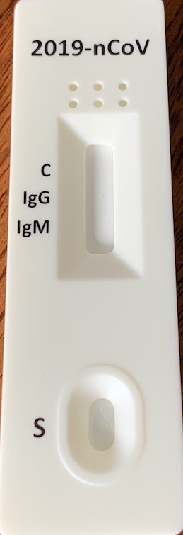
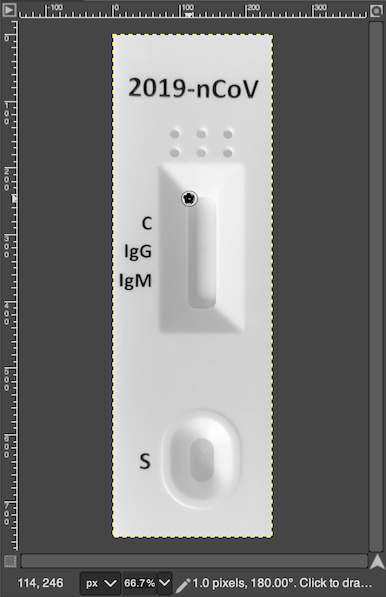
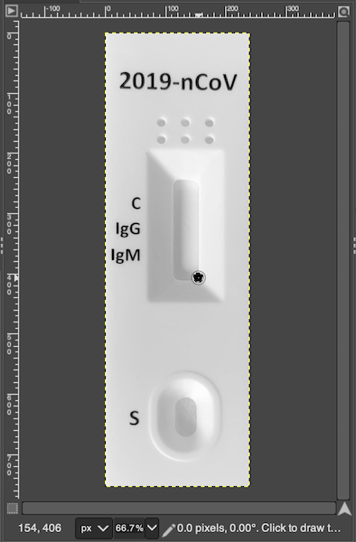
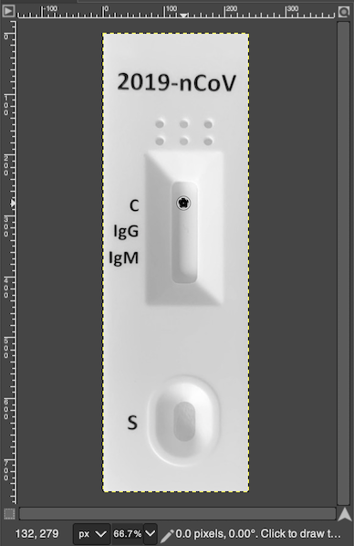
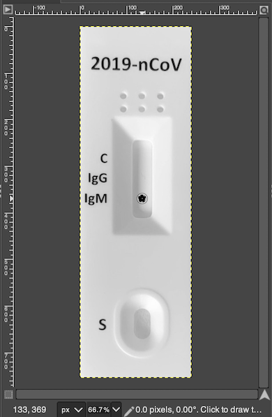

# Configuration for New RDTs
Please follow the instruction to add new RDTs to the app.

## 1. Getting a suitable template
RDTScan requires a clear, upright, and tightly cropped image of an unused RDT. Below are some examples of good and bad images:

Good Example               |  Bad Example 1            |  Bad Example 2            |  Bad Example 3            |  Bad Example 4
:-------------------------:|:-------------------------:|:-------------------------:|:-------------------------:|:-------------------------:
|  |  |   |  |  |
| Cropped and perspective-corrected. | Too far away. Background included. | Only a part of RDT is shown. | Only a part of RDT is shown. | RDT is skewed. |

There are two ways to get such an image:
1. Use a document scanning app like [OfficeLens](https://play.google.com/store/apps/details?id=com.microsoft.office.officelens&hl=en). As long as the RDT is on a clean and distinct background, the app will perform perspective correction and crop the image tightly around the RDT. 
2. Take a photo yourself using a camera. The camera should be as parallel to the RDT as possible (i.e., each corner of the RDT should be 90&deg;). Open up the photo using an image-editing program (e.g., PhotoShop, GIMP) and crop the image as close to the RDT's edges as possible.

Once you have the template image, add it to the following folder in your Android code: `app/src/main/res/drawable/nodpi/`.

## 2. Identifying regions of interest
When trained clinicians look at an RDT design, they can usually quickly infer where test results should appear on the RDT and what they should mean. Currently, you will need to provide RDTScan with information to bootstrap the algorithm.

### Location of result window (required)
This information will tell RDTScan where the image should be cropped so the user can see a zoomed version of their results.
|                        | Top-Left Corner (x, y) | Bottom-Right Corner (x, y) |
| :--------------------: | :--------------------: | :------------------------: |
|  |  |  |

### Location of control/test lines (required)
This information will tell RDTScan where the different lines should be located. This is used to help RDTScan assign meaning to each of the lines and to prevent RDTScan from picking up on marks that are not actual lines.
|                        | Top line (x, y)  | Middle line (x, y)  | Bottom line (x, y)  |
| :--------------------: | :-------------------------: | :----------------------------: | :----------------------------: | 
|  |  |  |  |

### Location of fiducials (optional)
Some RDTs may have the samge general design, but vary in exact appearance from test to test because they include a visual feature that encodes a unique identifier (e.g., barcode, QR code). Similarly, some designs vary because they are cut from a sheet at an interval that is different from their underlying pattern (e.g., [Quidel's QuickVue Influenza A+B Test](https://www.quidel.com/immunoassays/rapid-influenza-tests/quickvue-influenza-test). These designs can produce features that are inconsistent across RDTs from the same brand, thus complicating RDTScan's feature-based template-matching approach. To accommodate such designs, you can specify the location of visual features that are consistently in the same location but vary in appearance across RDTs. RDTScan considers these features to be _fiducials_ and use their location as additional information for locating the RDT's result window.
|                        | Fiducial corners [(x, y), (x, y)] |
| :--------------------: | :---------------------: |
|  |  |

## 3. Modifying the configuration file
If you are working directly on our repository, open `app/src/main/assets/config.json`. If you are starting from scratch, copy that file over to the corresponding location in your code. The key value of each entry, corresponding to the RDT's name , will be used throughout the code as a lookup identifier. The values that follow the key are listed below:

| **Data Field**                      | **Required?**       | **Data Types**       | **Range**    | **Description**    |
| :---------------------------------- | :-----------------: | :------------------- | :----------- |:----------------- |
| `REF_IMG`                           | :heavy_check_mark:  | `String`             |              | Filename of the template image for the RDT |
| `VIEW_FINDER_SCALE`                 | :heavy_check_mark:  | `double`             | min = `0.0`, max = `1.0`   | Relative height of the viewfinder compared to screen's height |
| `RESULT_WINDOW_RECT_TOP_LEFT`       | :heavy_check_mark:  | `[double, double]` |              | (x, y) coordinates of result window's top-left corner |
| `RESULT_WINDOW_RECT_BOTTOM_RIGHT`   | :heavy_check_mark:  | `[double, double]` |              | (x, y) coordinates of result window's bottom-right corner |
| `TOP_LINE_POSITION`                 | :heavy_check_mark:  | `[double, double]` |              | (x, y) coordinates of the top line's center point |
| `TOP_LINE_HUE_RANGE`                 | :heavy_minus_sign:  | `[[double, double],...]` |  min = `0.0`, max = `180.0`           | Range of hue values for the top line color |
| `MIDDLE_LINE_POSITION`              | :heavy_check_mark:  | `[double, double]` |              | (x, y) coordinates of the middle line's center point |
| `MIDDLE_LINE_HUE_RANGE`                 | :heavy_minus_sign:  | `[[double, double],...]` |  min = `0.0`, max = `180.0`            | Range of hue values for the middle line color |
| `BOTTOM_LINE_POSITION`              | :heavy_check_mark:  | `[double, double]` |              | (x, y) coordinates of the bottom line's center point |
| `BOTTOM_LINE_HUE_RANGE`                 | :heavy_minus_sign:  | `[[double, double],...]` |  min = `0.0`, max = `180.0`            | Range of hue values for the bottom line color |
| `TOP_LINE_NAME`                     | :heavy_check_mark:  | `String`             |              | Meaning of the top line (e.g., "Control", "Influenza A"). (**Note**) One of the line names must be `Control`.|
| `MIDDLE_LINE_NAME`                  | :heavy_check_mark:  | `String`             |              | Meaning of the middle line (e.g., "Control", "Influenza A"). (**Note**) One of the line names must be `Control`.|
| `BOTTOM_LINE_NAME`                  | :heavy_check_mark:  | `String`             |              | Meaning of the bottom line (e.g., "Control", "Malaria P.f"). (**Note**) One of the line names must be `Control`.|
| `LINE_INTENSITY`                    | :heavy_minus_sign:  | `int`                | min = `0`, max = `255`     | Minimum intensity of the line (default = 80) |
| `CHECK_GLARE`                      | :heavy_minus_sign:  | `boolean`             | `True`, `False`     | Whether RDTScan should check for glare in the result window. Should be set to `True` if the RDT has a reflective material |
| `FIDUCIALS`                 | :heavy_minus_sign:  | List of pairs of `[double, double]`  |              | (x, y) coordinates  of the top-left and bottom-right corners for each fiducial (**Note:** RDTScan currently only supports either no fiducials or two fiducials; this will be addressed in a later update) |

Note that the `LINE_INTENSITY` parameter gives you direct control over the interpretation accuracy of RDTScan for the target RDT. If RDTScan is under-reporting positive cases because it is missing faint lines, `LINE_INTENSITY` can be decreased to lower the threshold needed for a postivie test result. Conversely, `LINE_INTENSITY` can be increased if RDTScan is over-reporting positive cases. The default value is based on deployments and studies with a handful of RDT brands, so it should serve as a reasonable baseline in most cases.
