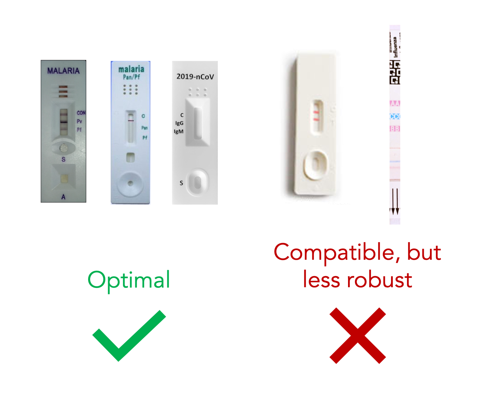

# Configuration for New RDTs
This repository already includes the files needed to use RDTScan with a few RDT designs that we have encountered during our research:
* SD Bioline Malaria Ag P.f
* [CareStart Malaria P.f/P.v](http://www.accessbio.net/eng/products/products01_02.asp)
* [Quidel's QuickVue Influenza A+B Test](https://www.quidel.com/immunoassays/rapid-influenza-tests/quickvue-influenza-test)

Extending RDTScan to accommodate a new RDT is a matter of three steps: (1) adding a clean photo of the RDT, (2) identifying some regions-of-interest using an image-editing program (e.g., Photoshop, GIMP), and then (3) adding that information and other metadata to a configuration file. This process is outlined below:

**Note:** Although RDTScan is designed to be as generalizable as possible, its feature-matching approach is less amenable to the following RDT characteristics:
* Blank cassettes with little or no lettering
* Inconsistent patterns (e.g., QR code, bar code)
* More than three result lines

For a relatively easy-to-understand explanation of how feature-matching works and why some designs are more amenable than others, please refer to this [tutorial](https://opencv-python-tutroals.readthedocs.io/en/latest/py_tutorials/py_feature2d/py_features_meaning/py_features_meaning.html) by OpenCV.

### 1. Getting a suitable template
RDTScan requires a clear, upright, and tightly cropped image of an unused RDT. Below are some examples of good and bad images:

TODO: example images that are good and bad

There are two ways to get such an image:
1. Use a document scanning app like [OfficeLens] (https://play.google.com/store/apps/details?id=com.microsoft.office.officelens&hl=en). As long as the RDT is on a clean and distinct background, the app will perform perspective correction and crop the image tightly around the RDT. 
2. Take a photo yourself using a camera. The camera should be as parallel to the RDT as possible (i.e., each corner of the RDT should be 90&deg;). Open up the photo in an image-editing program (e.g., PhotoShop, GIMP) and crop the image as close to the RDT's edges as possible.

Once you have the template image, add it to the following folder in your Android code: `app/src/main/res/drawable/nodpi/`.

### 2. Identifying regions of interest
TODO: open in image editor, include screenshots

### 3. Modifying the configuration file
If you are working directly on our repository, open the file `app/src/main/assets/config.json`. If not, copy that file over to oyr file 
3. Key is the name of the RDT, and add the parameters specified in config.json

| **Data Field**                      | **Required?**       | **Data Types**  | **Description**    |
| :---------------------------------- | :-----------------: | :-------------- | :----------------- |
| `REF_IMG`                           | :heavy_check_mark:  | `String`        | The filename of the template image for the RDT |
| `VIEW_FINDER_SCALE_H`               | :heavy_check_mark:  | `double`        | TODO |
| `VIEW_FINDER_SCALE_W`               | :heavy_check_mark:  | `double`        | TODO |
| `INTENSITY_THRESHOLD`               | :heavy_minus_sign:  | `int`           | TODO |
| `CONTROL_INTENSITY_PEAK_THRESHOLD`  | :heavy_check_mark:  | `double`        | TODO |
| `TEST_INTENSITY_PEAK_THRESHOLD`     | :heavy_check_mark:  | `double`        | TODO |
| `LINE_SEARCH_WIDTH`                 | :heavy_minus_sign:  | `double`        | TODO |
| Result window corners     | :heavy_check_mark:  | `(int, int)`   | The (x, y) pixel coordinates denoting the top-left and bottom-right corners of the general region where the results will appear |
| Control line position     | :heavy_check_mark:  | `int`          | The pixel position of the control line along the result window's wider axis |
| Test line position(s)     | :heavy_check_mark:  | `int`          | The pixel position of the test line(s) along the result window's wider axis |
| Meanings of test lines(s) | :heavy_check_mark:  | `String`       | The diagnostic decision that would be made if the corresponding line is visible and the test is performed correctly (e.g., `"control"`, `"malaria Pf"`) |
| Desired RDT scale         | :heavy_check_mark:  | `float`        | The ideal scale of the RDT relative to the width of the camera's standard image width |
| Line intensity            | :heavy_minus_sign:  | `int`          | TODO | 
| Fiducial locations        | :heavy_minus_sign:  | `(int, int)`   | The (x, y) pixel coordinates denoting the top-left and bottom-right corners of variable dark-colored markings that have a fixed location (e.g., QR code, bar code) |
| Line hues                 | :heavy_minus_sign: | `int`           | The expected hues of the control and test lines (range: 0-179) |
