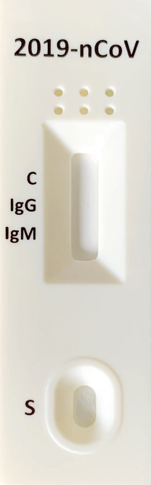
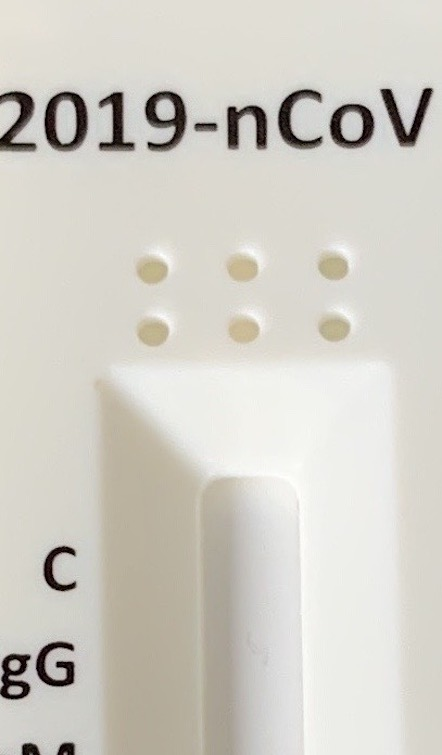
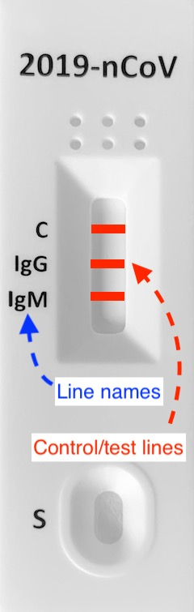
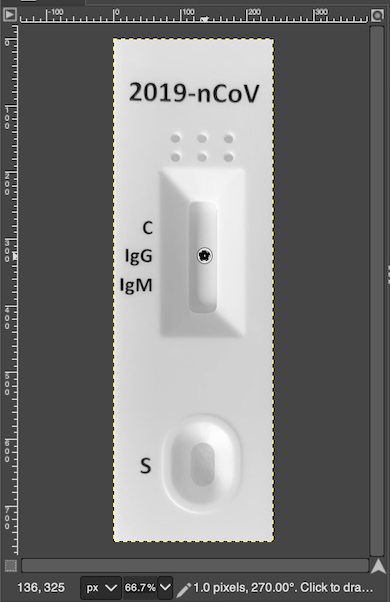

# Configuration for New RDTs
Please follow the instruction to add new RDTs to the app.

## 1. Getting a suitable template
RDTScan requires a clear, upright, and tightly cropped image of an unused RDT. Below are some examples of good and bad images:

Good Example               |  Bad Example 1            |  Bad Example 2            |  Bad Example 3            |  Bad Example 4
:-------------------------:|:-------------------------:|:-------------------------:|:-------------------------:|:-------------------------:
|  |  |   |  |  |
| Cropped and perspective-corrected. | Too far away. Background included. | Only a part of RDT is shown. | Only a part of RDT is shown. | RDT is skewed. |

There are two ways to get such an image:
1. Use a document scanning app like [OfficeLens](https://play.google.com/store/apps/details?id=com.microsoft.office.officelens&hl=en). As long as the RDT is on a clean and distinct background, the app will perform perspective correction and crop the image tightly around the RDT. 
2. Take a photo yourself using a camera. The camera should be as parallel to the RDT as possible (i.e., each corner of the RDT should be 90&deg;). Open up the photo in an image-editing program (e.g., PhotoShop, GIMP) and crop the image as close to the RDT's edges as possible.

Once you have the template image, add it to the following folder in your Android code: `app/src/main/res/drawable/nodpi/`.

## 2. Identifying regions of interest
When trained clinicians look at an RDT design, they can usually quickly infer where test results should appear on the RDT and what they should mean. Currently, RDTScan needs developers to provide that information to bootstrap the algorithm.

### Location of result window
|                        | Top-Left Corner (x, y) | Bottom-Right Corner (x, y) |
| :--------------------: | :--------------------: | :------------------------: |
|  |  |  |

### Location of control/test lines
|                        | Top line (y-position only)  | Middle line (y-position only)  | Bottom line (y-position only)  |
| :--------------------: | :-------------------------: | :----------------------------: | :----------------------------: | 
|  |  |  |  |

## 3. Modifying the configuration file
If you are working directly on our repository, open the file `app/src/main/assets/config.json`. If not, copy that file over to the corresponding location in your code. The key value of each entry, corresponding to the RDT's name , will be used throughout the code as a lookup identifier. The values that follow the key are listed below:

| **Data Field**                      | **Required?**       | **Data Types**       | **Range**    | **Description**    |
| :---------------------------------- | :-----------------: | :------------------- | :----------- |:----------------- |
| `REF_IMG`                           | :heavy_check_mark:  | `String`             |              | Filename of the template image for the RDT |
| `VIEW_FINDER_SCALE_H`               | :heavy_check_mark:  | `double`             | min = 0.0, max = 1.0   | Relative height of the view finder compared to screen height |
| `VIEW_FINDER_SCALE_W`               | :heavy_check_mark:  | `double`             |              | Relative width of the view finder compared to screen height |
| `RESULT_WINDOW_RECT_TOP_LEFT`       | :heavy_check_mark:  | [`double`, `double`] |              | (x, y) coordinates of top-left corner of result window |
| `RESULT_WINDOW_RECT_BOTTOM_RIGHT`   | :heavy_check_mark:  | [`double`, `double`] |              | (x, y) coordinates of bottom-right corner of result window |
| `TOP_LINE_POSITION`                 | :heavy_check_mark:  | `double`, `double`] |              | (x, y) coordinates of the center of the top line |
| `MIDDLE_LINE_POSITION`              | :heavy_check_mark:  | `double`, `double`] |              | (x, y) coordinates of the center of the middle line |
| `BOTTOM_LINE_POSITION`              | :heavy_check_mark:  | `double`, `double`] |              | (x, y) coordinates of the center of the bottom line |
| `LINE_SEARCH_WIDTH`                 | :heavy_check_mark:  | `double`             |              | Gap between two consecutive lines |
| `TOP_LINE_NAME`                     | :heavy_check_mark:  | `String`             |              | Meaning of the top line (e.g., "Control", "Influenza A") |
| `MIDDLE_LINE_NAME`                  | :heavy_check_mark:  | `String`             |              | Meaning of the middle line (e.g., "Control", "Influenza A") |
| `BOTTOM_LINE_NAME`                  | :heavy_check_mark:  | `String`             |              | Meaning of the bottom line (e.g., "Control", "Malaria P.f") |
| `LINE_INTENSITY`                    | :heavy_minus_sign:  | `int`                | min = 0, max= 255     | Minimum intensity of the line (default = 80) |
| `FIDUCIAL_COUNT`                    | :heavy_minus_sign:  | `double`             |              | TODO |
| `FIDUCIAL_DISTANCE`                 | :heavy_minus_sign:  | `double`             |              | TODO |
| `FIDUCIAL_POSITION_MIN`             | :heavy_minus_sign:  | `double`             |              | TODO |
| `FIDUCIAL_POSITION_MAX`             | :heavy_minus_sign:  | `double`             |              | TODO |
| `FIDUCIAL_MIN_HEIGHT`               | :heavy_minus_sign:  | `double`             |              | TODO |
| `FIDUCIAL_MIN_WIDTH`                | :heavy_minus_sign:  | `double`             |              | TODO |
| `FIDUCIAL_MAX_WIDTH`                | :heavy_minus_sign:  | `double`             |              | TODO |
| `FIDUCIAL_TO_RESULT_WINDOW_OFFSET`  | :heavy_minus_sign:  | `double`             |              | TODO |

Note that the `LINE_INTENSITY` gives the developer direct control over the interpretation accuracy of RDTScan for the target RDT. If RDTScan is under-reporting positive cases because it is missing faint lines, `LINE_INTENSITY` can be decreased to lower the threshold needed for a postivie test result. Conversely, if RDTScan is over-reporting positive cases, `LINE_INTENSITY` can be increased.
